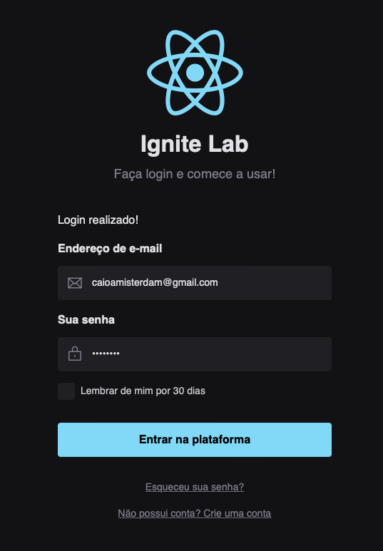

# Ignite Lab | Design System

  
  
  

## 💻 Overview
Projeto desenvolvido durante o Ignite Lab da Rockeatseat.
 Página de login criado no Figma, com o propósito de criar componentes para um Design System. Do Figma, partimos para o código e criamos uma biblioteca de componentes com o Storybook, uma ferramenta usada para desenvolver a interface do usuário (UI) e que permite a criação de componentes e testes isolados.

## Preview

## ⚒️ Tecnologias
- React JS
- Vite
- JavaScript
- TypeScript
- Storybook
- Figma
- Tailwind CSS
- Radix UI
- Jest
- Mock Service Worker

## 📐  Protótipo
🔗 [Clique aqui e veja o projeto no Figma](https://www.figma.com/file/yLWngswm5eRH4TP71S7xZW/Ignite-Lab?node-id=0%3A1)

## 👨🏻‍💻 Acesse o projeto

🔗 [Clique aqui para acessar o Design System no Storybook](https://caioamisterdam.github.io/ignite-lab-design-system/)

 
